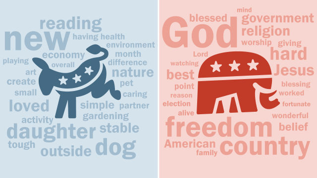

# NLP - Classificatin of US senator tweets

##  For the Machine Learning for Natural Language Processing 2022 course 

### By Violaine Courrier & Justin Aguenier





Colab instructions : 

- To load the dataframe, you need to generate a kaggle ```API Token```. Please read the following page to do so : 

[Link for tutorial](https://www.analyticsvidhya.com/blog/2021/06/how-to-load-kaggle-datasets-directly-into-google-colab/)

- All the dependencies (sometime cell with comments) have to be installed inside the notebook

- ⚠️ WE ADD A PROBLEM WITH OUR NETWORK. FOR THE INFERENCE PART, THE ALGORITHM ONLY PREDICTS THE SAME CLASS

- ✅ WE WILL SEND RESULTS TO OUR LAB TEACHER AS SOON AS POSSIBLE. WE ARE SORRY FOR THIS ISSUE. THE BUG ARRIVED QUIT LATE IN THE PROJECT, WE DIT NOT MANAGE TO FIX IT. 


